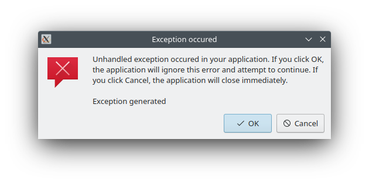

# ApplicationAndException

Shows how to create a dark mode application.

## Sources

[src/ApplicationAndException.h](src/ApplicationAndException.h)

[src/ApplicationAndException.cpp](src/ApplicationAndException.cpp)

[CMakeLists.txt](CMakeLists.txt)

## Output



## Generate and build

### Qt Creator

To build these projects, open `ApplicationAndException.pro` file with Qt Creator.

### CMake

To build this project, open "Terminal" and type following lines:

Set `CMAKE_PREFIX_PATH` with Qt6 install path.

#### Windows :

``` cmake
mkdir build
cd build
cmake ..
start ./ApplicationAndException.sln
```

#### macOS :

``` cmake
mkdir build
cd build
cmake .. -G "Xcode"
open ./ApplicationAndException.xcodeproj
```

#### Linux with Code::Blocks :

``` cmake
mkdir build
cd build
cmake .. -G "CodeBlocks - Unix Makefiles"
xdg-open ./ApplicationAndException.cbp > /dev/null 2>&1
```

#### Linux :

``` cmake
mkdir build
cd build
cmake .. 
cmake --build . --config Debug
./ApplicationAndException
```
