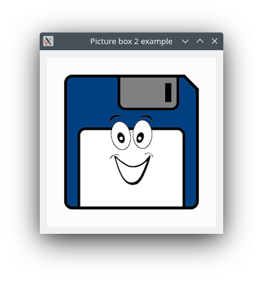

# PictureBox2

Shows how to create a picture box with QGraphicsPixmapItem.

## Sources

[src/PictureBox2.h](src/PictureBox2.h)

[src/PictureBox2.cpp](src/PictureBox2.cpp)

[Resources/Logo.png](Resources/Logo.png)

[PictureBox2.qrc](PictureBox2.qrc)

[CMakeLists.txt](CMakeLists.txt)

## Output



## Generate and build

### Qt Creator

To build these projects, open `PictureBox2.pro` file with Qt Creator.

### CMake

To build this project, open "Terminal" and type following lines:

Set `CMAKE_PREFIX_PATH` with Qt6 install path.

#### Windows :

``` cmake
mkdir build
cd build
cmake ..
start ./PictureBox2.sln
```

#### macOS :

``` cmake
mkdir build
cd build
cmake .. -G "Xcode"
open ./PictureBox2.xcodeproj
```

#### Linux with Code::Blocks :

``` cmake
mkdir build
cd build
cmake .. -G "CodeBlocks - Unix Makefiles"
xdg-open ./PictureBox2.cbp > /dev/null 2>&1
```

#### Linux :

``` cmake
mkdir build
cd build
cmake .. 
cmake --build . --config Debug
./PictureBox2
```
